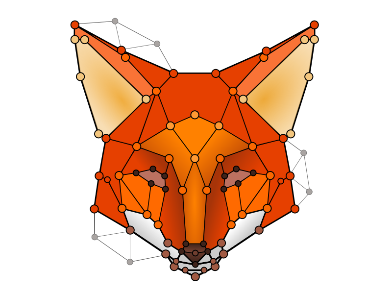
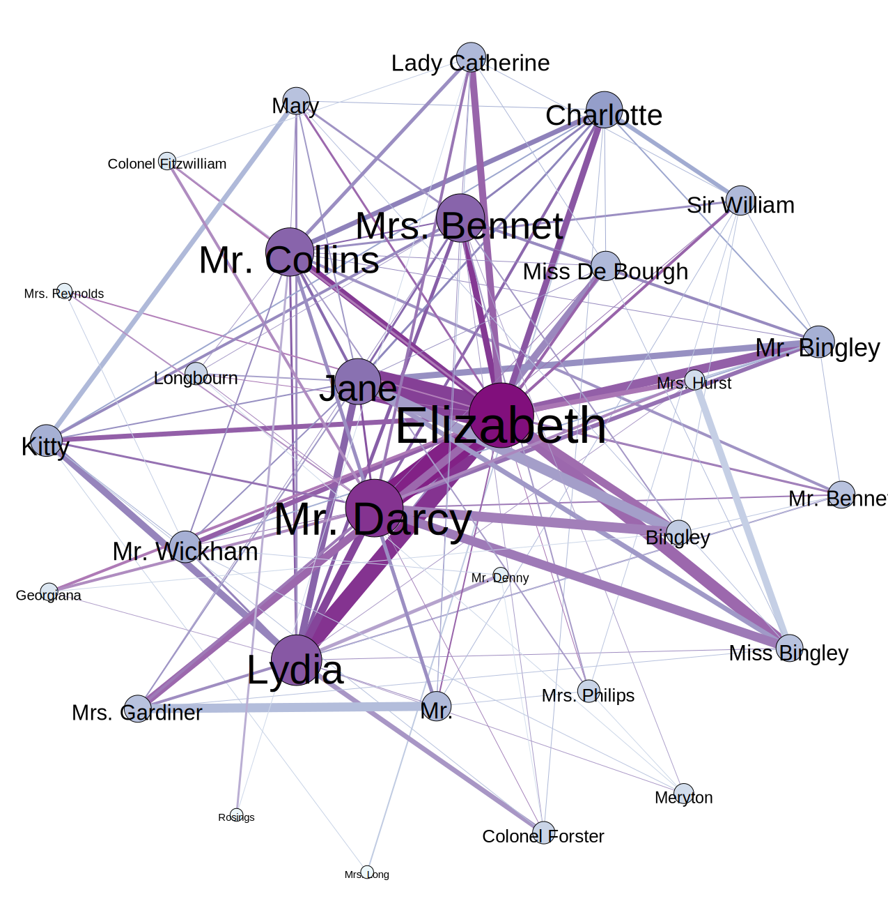

============
Introduction
============

	   

Renard (Relationships Extraction from NARrative Documents) is a
character networks extraction pipeline written in Python. Character
networks are graphs where each node represent a character, and the
edges between nodes represent the relationship between two
characters. These networks have several possible applications:

- They allow intuitive visualisation of the relationships between
  characters in a story
- They can be used as an analysis tool
- They allow to encode the relationship between characters of a text
  in a single mathematical object

See LabatutAndBost2019_ for a more complete overview of character
networks and their automated extraction.

.. _LabatutAndBost2019: https://arxiv.org/abs/1907.02704

Target Audience and Intended Usage
==================================

Renard can be used by digital humanities researchers to extract
character networks, for example to bring additional information when
performing literary analysis.

Renard can also be used by Natural Language Processing (NLP)
researchers and practitioners to extract graph representations of
texts, in order to use these as inputs to downstream NLP tasks. Graphs
embedding algorithms such as Graph2Vec may be used on these graphs to
derive a vectorial representation of texts.
